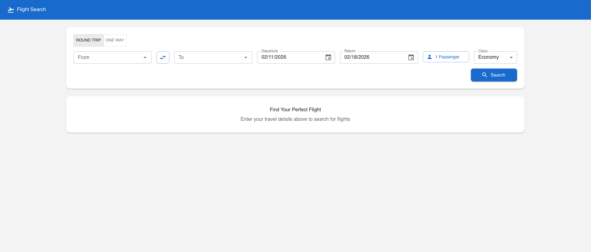
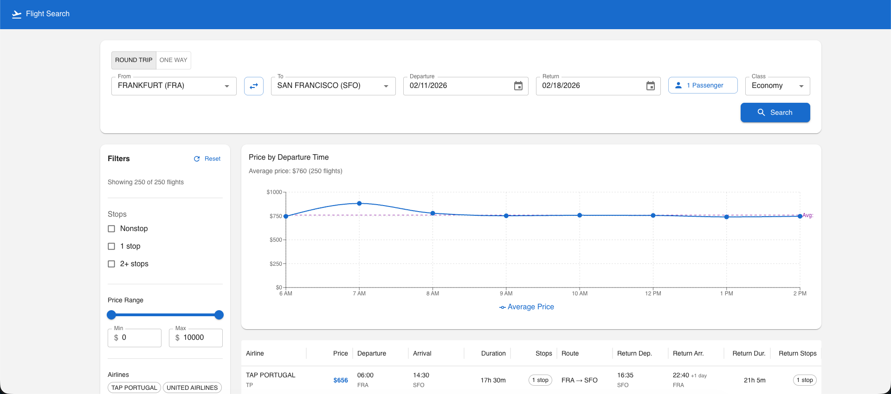
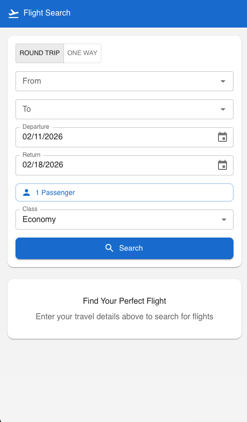
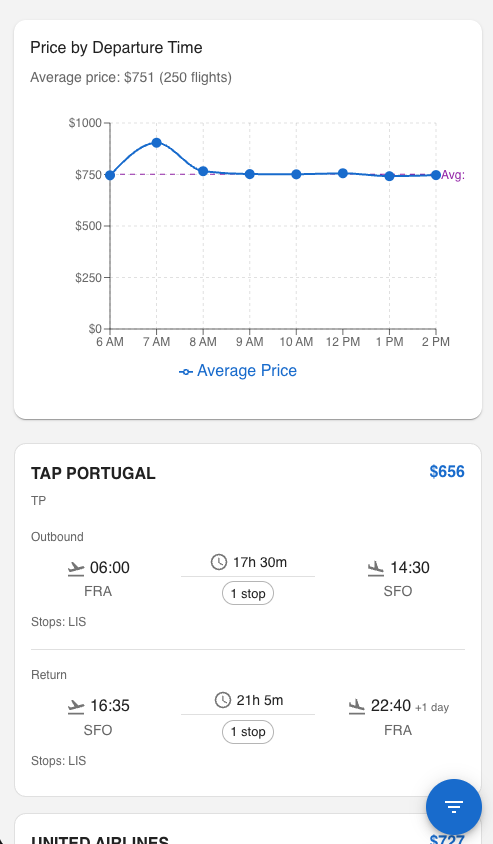

# Flight Search

A React flight search application powered by the Amadeus API with advanced filtering and price analytics.

## Tech Stack

| Layer    | Technology                          |
| -------- | ----------------------------------- |
| Frontend | React 19, TypeScript, Vite          |
| UI       | Material-UI (MUI) + MUI X DataGrid |
| State    | TanStack React Query, React Context |
| Forms    | react-hook-form, zod               |
| Charts   | Recharts                            |
| API      | Axios, Amadeus REST API             |
| Testing  | Vitest, MSW, Testing Library        |

## Features

- **Flight search** — round-trip and one-way, configurable passengers and travel class
- **Location autocomplete** — airport and city search with type distinction
- **Advanced filtering** — stops, price range, airlines, departure/arrival time, duration
- **Price analytics** — interactive chart for comparing flight prices
- **Responsive layout** — DataGrid view on desktop, card-based view on mobile
- **Persistent grid preferences** — column order, sorting, and density saved across sessions

## Project Structure

```
src/
├── api/                    # Axios client and API layer
│   ├── auth.ts             # OAuth2 token management with auto-refresh
│   ├── client.ts           # Axios instance with auth interceptors
│   └── endpoints/          # API endpoint functions (flights, locations)
├── components/
│   ├── common/             # AsyncAutocomplete, PassengerSelector
│   ├── feedback/           # ErrorBoundary, LoadingOverlay, SkeletonCard
│   └── layout/             # Header, AppLayout
├── features/
│   ├── analytics/          # PriceChart visualization
│   ├── filters/            # FilterPanel and individual filter components
│   ├── results/            # FlightCard, FlightDataGrid, StopDetailsPopup
│   └── search/             # SearchForm
├── hooks/                  # useDebounce, useFlightSearch, useLocationSearch, etc.
├── providers/              # SearchContext (search params, results, filter state)
├── services/               # Data transformation utilities
├── styles/                 # MUI theme configuration
├── types/                  # TypeScript interfaces for API responses and app state
└── utils/                  # Constants and formatters
```

## Screenshots

### Desktop

#### Homepage



#### Result



### Mobile

|                    Homepage                    |                      Result                      |
|:----------------------------------------------:|:------------------------------------------------:|
|  |  |

## Prerequisites

- Node.js 18+
- npm
- [Amadeus API](https://developers.amadeus.com/) client credentials (free self-service tier available)

## Getting Started

1. Clone the repository:
   ```bash
   git clone <repository-url>
   cd flight-search
   ```

2. Install dependencies:
   ```bash
   npm install
   ```

3. Create a `.env` file in the project root:
   ```
   VITE_AMADEUS_API_BASE_URL=https://test.api.amadeus.com
   VITE_AMADEUS_CLIENT_ID=your_client_id
   VITE_AMADEUS_CLIENT_SECRET=your_client_secret
   ```

4. Start the development server:
   ```bash
   npm run dev
   ```

## Available Scripts

| Command              | Description                          |
| -------------------- | ------------------------------------ |
| `npm run dev`        | Start development server             |
| `npm run build`      | TypeScript check + Vite build        |
| `npm run lint`       | Run ESLint                           |
| `npm run test`       | Run tests in watch mode              |
| `npm run test:coverage` | Run tests with coverage report    |
| `npm run preview`    | Preview production build locally     |

## Environment Variables

| Variable                      | Description                  |
| ----------------------------- | ---------------------------- |
| `VITE_AMADEUS_API_BASE_URL`   | Amadeus API base URL         |
| `VITE_AMADEUS_CLIENT_ID`      | Amadeus API client ID        |
| `VITE_AMADEUS_CLIENT_SECRET`  | Amadeus API client secret    |

## Testing

Run the full test suite in watch mode:

```bash
npm run test
```

Run a single test file:

```bash
npx vitest tests/hooks/useDebounce.test.ts
```

Generate a coverage report:

```bash
npm run test:coverage
```

Tests use [MSW](https://mswjs.io/) to mock Amadeus API responses, so no network access or API credentials are needed during testing.
